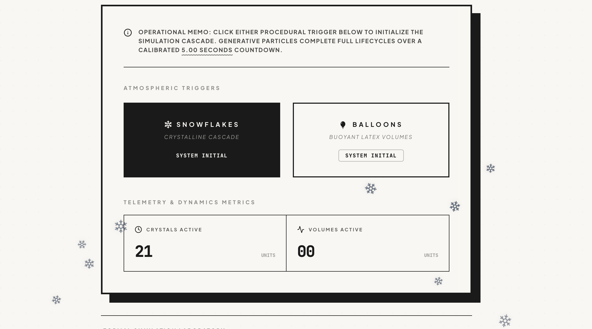
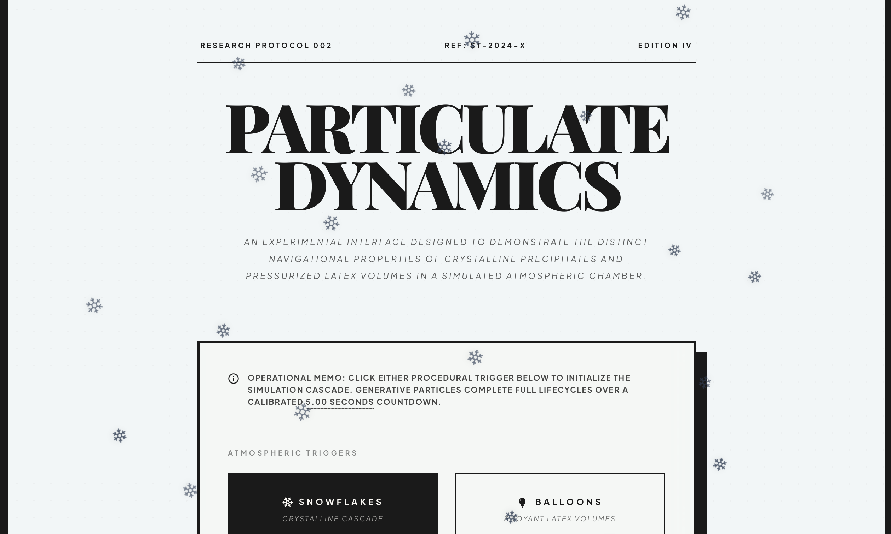

Using Google AI studio to build an application.

### 1. Prompt (Prototype):
Create a formal looking frontend application that has two buttons: "Snowflakes" and "Balloons".  
If the user clicks on the "Snowflakes" button, snowflakes of medium size should start falling on the screen from top to bottom for 5 seconds.  
If the user clicks on the "Balloons" button, balloons of medium size should start floating from the bottom of the screen and float to the top for 5 seconds.

### 2. Deploy on cloud

### Recommended Documentation & Guides
[Prompt Design Strategies](https://ai.google.dev/gemini-api/docs/prompting-strategies): Learn the core principles of structuring prompts, using system instructions, implementing few-shot examples, and controlling output format.

[Function Calling with the Gemini API](https://ai.google.dev/gemini-api/docs/interactions/function-calling): Connect your deployment to external tools and APIs, allowing the Gemini model to output structured data and trigger real-world application logic.

[Text-to-Speech Generation](https://ai.google.dev/gemini-api/docs/speech-generation): Learn how to generate spoken audio using the Gemini API, control speech styles, and test voices using the Voice Library in Google AI Studio.